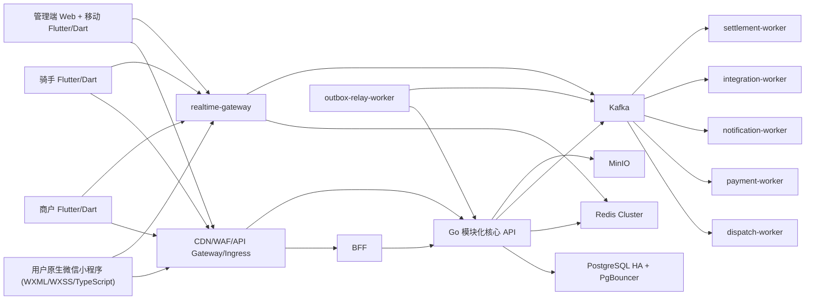

# Infinitech 2.0 系统架构

架构名称：自建/混合云 Kubernetes 上的模块化核心 API + 事件驱动 Worker + 多端 BFF + 实时网关架构。

核心原则：

- 订单、支付、钱包、抢单、派单强一致。
- 消息、通知、RTC 信令事件驱动、可重试、可补偿。
- 核心 API 首期采用模块化单体，避免资金和订单链路过早陷入分布式事务。
- Worker 通过 Kafka 消费事件，所有关键任务必须幂等。
- 未完成 `10k/30k/60k/100k` 压测前，不宣称已支撑 10 万在线。

商家与店铺建模：

- 商家账号负责主体、权限、资质、合同、结算和钱包。
- 商家账号只能通过管理员邀请链接注册；邀请链接必须可撤销、可过期、可审计。
- 店铺负责用户侧展示页、商品、团购套餐、评价、公告、资质展示和服务能力。
- 同一店铺可同时开通外卖和团购；医务室/药房通过账号类型、店铺类别和资质约束开通买药能力。
- 店铺必须有营业执照和健康证资质记录，资质记录必须包含文件地址、审核状态和失效日期。
- 资质过期或未审核通过时，核心 API 将店铺置为 `qualification_expired`，BFF 对用户端关闭下单入口，商户端显示补资料弹窗。
- 商户端维护员工信息和补充资料，员工健康证也需要可记录失效日期。
- 快递/跑腿是平台服务入口，不作为普通商家店铺能力，订单进入骑手履约链路。
- 团购订单履约模式为到店扫码验券，不进入骑手抢单/派单。

骑手、站长与调度：

- 骑手端分为 `station_manager` 站长账号和 `rider` 骑手账号，二者都只能通过邀约注册。
- 站长可查看站点全部订单、骑手、收入、位置、异常和任务时长数据，并可手动派单。
- 站长可配置站点每日任务时长，骑手端展示自己的目标和完成情况。
- 派单策略固定为下单 10 分钟内进入抢单大厅；10 分钟及以上未抢单则自动派单。
- 骑手拒绝派单后，调度服务跳过该骑手并立即选择下一位符合条件的在线骑手。
- 骑手接单前必须缴纳 50 元保证金，或微信免押审核通过；商户接单前必须缴纳 50 元保证金且不支持免押。
- 骑手退保证金从最后一单完成时间和离职提交时间中较晚者起算一周；如有纠纷，从纠纷关闭时间后顺延一周。
- 后台记录并展示骑手接单时间、平均接单耗时、日均完成单量、完成率、站点团队均值和等级。
- 骑手等级按站点团队整体水平相对评估，派单优先按等级优先级、平均接单耗时和距离排序。
- 站长或后台可配置每日固定订单数；骑手完成固定数后，后续派单可免责不接并留审计。

商户商品、团购与退款：

- 商户端可维护自己的美团外卖式店铺展示页，包括头图、logo、公告、优惠、评价展示、资质展示、外卖商品和团购套餐。
- 菜品/商品必须支持图片、描述、配料表、价格、库存、上下架和售罄状态。
- 团购券以二维码作为核销凭证，商户端提供二维码扫描器，到店扫码后核销，不进入骑手调度链路。
- 团购券可长期保留；若商品/套餐下架、售罄或库存为 0，未核销券进入自动退款。
- 平台退款默认策略可由后台配置为 `balance_first` 或 `original_route_first`；当前产品默认倾向退回平台余额。
- 用户余额支付前必须设置余额支付密码，未设置、锁定或风控异常时不能使用余额支付。

群聊、红包与优惠券：

- 用户注册后自动加入官方群聊，官方群默认消息不通知。
- 商户可以创建自己的群聊，并将优惠券配置为必须进群后才能领取或使用。
- 群聊和私聊都支持余额红包，发送人可以是用户、商户、骑手或官方客服。
- 红包资金从平台余额扣除，支持总金额、数量、普通定额红包和拼手气红包。
- 红包、领券和群成员关系都必须有资金流水、事件日志和风控审计。

圈子、小微墙与饭搭：

- 用户端首页增加 `circle` 圈子入口，后台可开关、排序、灰度；首期做轻量“小微墙”信息流。
- `HCRXchenghong/InfiniLink` 只作为圈子信息流、发帖、圈子列表、消息入口的参考，不整仓嵌入，不复用其旧支付、会员和后端结构。
- 圈子内容必须支持后台审核、隐藏、删除、置顶、举报和敏感词治理。
- 找饭搭基于问卷生成性格特征和饮食习惯标签，再做候选人匹配。
- 使用找饭搭前，用户必须完善性别，并签署身份真实性承诺和“个人行为与平台无关”免责承诺。
- 饭搭匹配、聊天和线下见面必须有显著安全提示、举报入口和风控审计。

优惠券与首页卡片：

- 商户可自行发券，优惠成本由商户承担。
- 平台可发券，若成本由平台承担，平台账户产生补贴流水并在结算时补贴给商户。
- 平台活动也可要求商户弹窗确认参与；商户点击同意后，该活动券成本由商户承担。
- 优惠券适用范围支持仅限单个商家或参与活动的全部商家。
- 首页商品/店铺/团购/券/圈子卡片全部由后台配置，支持开关、排序、投放时间、目标对象和灰度。

旧版闭环能力保底：

- 用户端必须保留旧版已有的地址、搜索、购物车、备注、餐具数量、支付结果、订单追踪、售后、评价、收藏、红包优惠、钱包充值/提现/账单、积分商城、会员中心、反馈合作和公益入口。
- 商户端必须保留旧版已有的经营概况、订单处理、在线沟通、商品新增/编辑、店铺创建/切换/设置和钱包。
- 骑手端必须保留旧版已有的钱包充值/提现、账单、收入、数据统计、个人资料、接单设置、健康证、保险、违规申诉、骑手之家、历史订单和客服。
- 后台必须保留旧版已有的售后、优惠券、首页入口/活动/精选商品、内容推送、数据管理、饭搭治理、财务交易、电话联系审计、RTC 审计、系统日志、开放平台权限和文档。
- 所有这些能力在 2.0 中必须比旧版多一层：统一合同、幂等、权限、审计、风控和测试。
